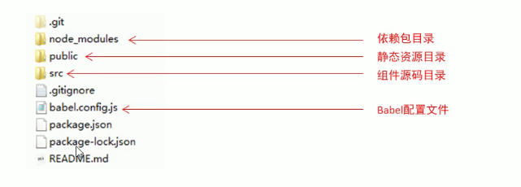

# 准备工作
- 安装node.js,查看安装node.js版本cmd命令下node -v
- 安装脚手架,cmd命令npm install -g @vue/cli
- 查看脚手架版本,cmd下vue -V

# 脚手架使用
## 地址
- https://cli.vuejs.org/zh/guide/
## 命令创建
- 选择项目的磁盘路径: cd /d F:\HTMLFolder
- 创建项目vue_peoject1: vue create vue_peoject1
- 选择一系列文件包
- cd到项目文件夹 cd create vue_peoject1
- 启动项目 npm run serve

## 可视化创建
- 打开界面,cmd命令vue ui
- 选择创建的路径
- 添加项目名
- 第一次选择手动创建
- 手动创建后选择Babel-Router-Vuex-Linter/Formatter-使用配置文件
- 关闭历史路由-选择ESLint + Standard config-打开Lint on save 

## 基于旧版2.0项目的创建
- 下载依赖包 npm install -g @vue/cli-init
- 创建项目 vue init webpack vue_project2

## 项目结构
